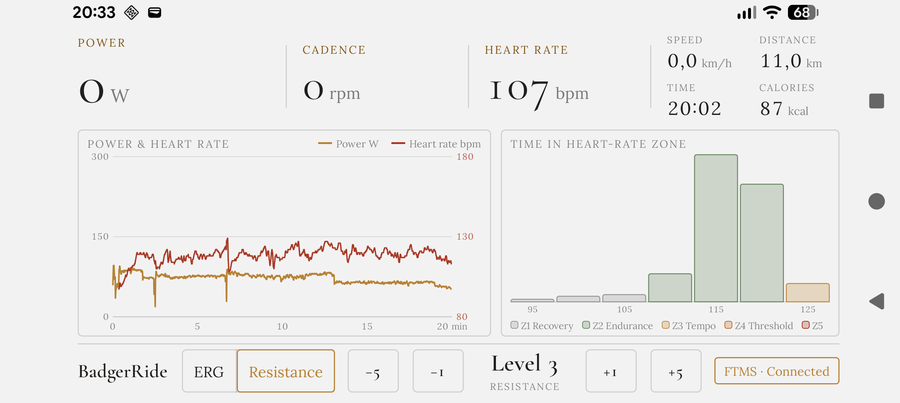

# BadgerRide — FTMS ERG training app

Android app that drives an **FTMS bike trainer** (e.g. Hammer Varon XTR II) in ERG or
resistance mode and reads a **Polar H10** heart-rate strap over BLE. Grown out of the
single-file Erg PoC (first commit); the BLE/FTMS core is the PoC's, restructured.

Two screens, styled after the *Classical* design system

- **Ride** (landscape, launcher): live power / cadence / heart rate, speed, distance,
  moving time and calories; a power + heart-rate chart with the dashed ERG target;
  a time-in-HR-zone histogram; ERG ⇄ Resistance toggle and ± target buttons.
  While a ride is running the status tag becomes **Finish Ride**; otherwise it (or
  the brand) opens Settings.
- **Settings** (portrait): connection status + scan, max-HR-derived training zones,
  calorie source (power: 1 kJ ≈ 1 kcal, or heart rate: Keytel), rider profile
  (weight/age/sex), metric/imperial units. Everything persists.

  

## How it works

1. Scans for the **Fitness Machine Service (0x1826)** and the **Heart Rate Service
   (0x180D)**, connects to the first of each (a trainer that relays HR is not
   double-connected).
2. Subscribes to Indoor Bike Data (and Cycling Power when present — it often
   notifies faster) and Heart Rate Measurement.
3. Enters ERG via the FTMS Control Point (0x2AD9):
   `Request Control (0x00)` → `Start/Resume (0x07)` → `Set Target Power (0x05)`.
   Each command waits for the trainer's 0x80 indication before the next is sent.
   Trainers whose feature read lacks the power target get ERG *emulated* by steering
   the bike-simulation grade (0x11) against reported power.
4. A 1 Hz loop re-sends the active target (some trainers only latch it while
   pedaling) and records the ride session (samples, distance, kJ, Keytel kcal).
5. Unexpected drops trigger a bounded reconnect (5 × 3 s), for both devices.

## Finished rides & Health Connect

A ride starts with the first pedal stroke and ends via the **Finish Ride** tag on the
Ride screen (with confirmation), or automatically after **5 minutes without trainer
activity** — the ride's end time is then the last pedal stroke, not the timeout.

While a ride is active a **foreground service** shows a "Ride in progress" notification
(time · distance · kcal, refreshed every 30 s) and keeps the process from being frozen,
so the ride keeps recording — and the idle auto-finish still fires — with the screen
off or the app in the background.

Finishing a ride:

- writes it to **Health Connect** as an *indoor cycling* workout — session, distance,
  active calories and the per-second heart-rate / power / speed / cadence series
  (permission is requested on first launch; a ride finished before the grant is kept
  and written once permission arrives),
- resets the on-screen statistics, and
- sends **FTMS Reset (0x01)** so the trainer clears its own session counters, then
  re-enters the control chain so ERG keeps working for the next ride.

Rides under a minute of moving time are reset without being exported.

## Build

```powershell
$env:JAVA_HOME = "C:\Program Files\Android\Android Studio\jbr"
.\gradlew.bat assembleDebug --console=plain --no-daemon
```

Or open in Android Studio and run on a **physical phone** — BLE does not work in the
emulator. minSdk 36 (Android 16). Grant the Bluetooth permissions when prompted.

## Usage

Wake the trainer, wet/wear the H10 strap, launch the app — it scans automatically
once permissions are granted (or use **Scan for devices** in Settings). Make sure no
other app (Kinomap/Zwift/Polar Flow) holds the connection — BLE peripherals accept
only one central at a time. "ERG unavailable: trainer refused control" almost always
means another app holds it.

## Fonts

Bundles **Cormorant Garamond** and **Lora** (variable), © their respective authors,
licensed under the SIL Open Font License 1.1.
